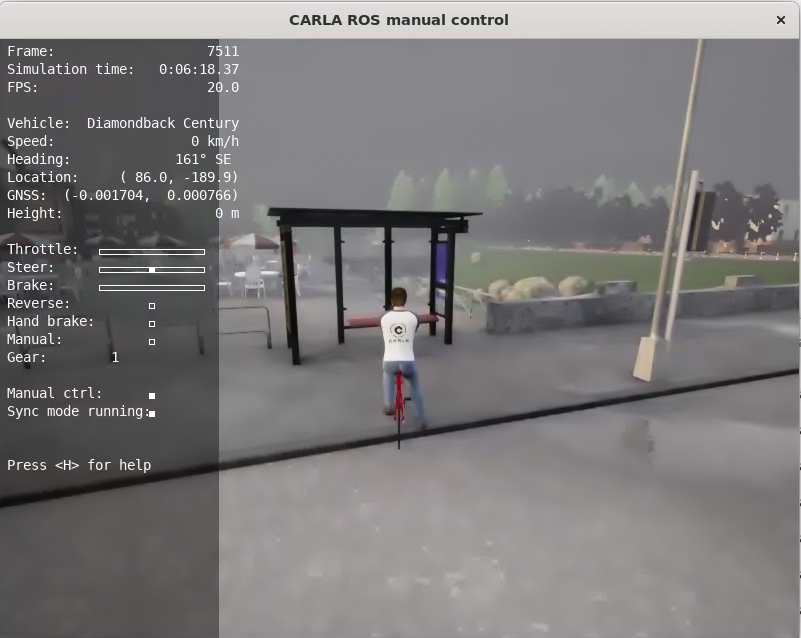

# Training Model on Holoscene Bike Simulator to detect benches

## Access the Cloud Instance

1. Install No Machine on your local machine: https://www.nomachine.com/download

2. Follow the instructions to connect : - 

        1. Open NoMachine
        2. Click on "New"
        3. Enter the IP address of the cloud instance and give a name to the connection
        4. Enter the username and password
        5. Click on "Connect"

Credentials: -

```
IP address of the cloud instance: 188.214.128.18
Username: developer
Password: 0771
```

## Start the Simulator

Open the terminal and run the following commands: -

```
cd Holoscene-SDV-Sim-pycycling_bt/bicycle
./run.sh
```

## Capture Images of bench

To capture images, open a new terminal and run the following commands: -

```
cd Holoscene-SDV-Sim-pycycling_bt/bicycle/images
source /opt/ros/foxy/setup.bash
python3 capture_images.py
```

You can capture images of bench like this: -



## Train model in Roboflow

1. Upload images to Roboflow, use this link: - https://app.roboflow.com/holoscene/holoscene-sim/upload

2. Annotate and Augment the images using the Roboflow interface.

3. Train the model using the Roboflow interface.

## Benchmarking

1. You can upload images to Roboflow and check the inference time of the model and the accuracy of the model.

2. Select real bench images and upload them to Roboflow and check the inference time of the model and the accuracy of the model.


## Credentials for Roboflow

Login to Google Account 

```
Username: apurv@borealbikes.com

password: holoscene@123
```

Using Google Account, login to Roboflow
